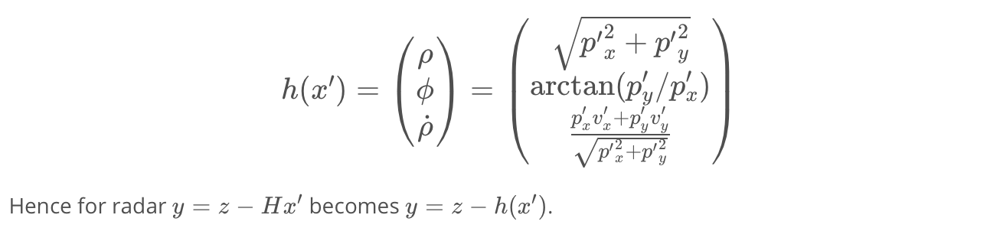
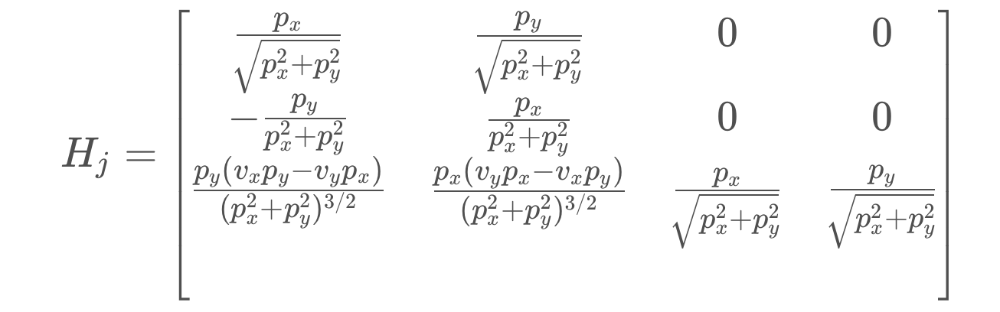

# **Extended Kalman Filter**

## **Objective**
This project describes implementation of extended Kalman Filter to track a car's position and velocity using lidar and radar measurements. The state vector is [x, y, velocity in x, velocity in y] using linear motion model.

## **Algorithm Overview**

  

  

The algorithm will go through the following steps:

* First measurement - The filter will receive initial measurements of the car's position relative to the observer's car. These measurements will come from a radar or lidar sensor.
* Initialize state and covariance matrices - The filter will initialize the car's position based on the first measurement.
* Predict - The algorithm will predict where the car will be after time Δt. One basic way to predict the car location after Δt is to assume the car's velocity is constant; thus the car will have moved velocity times Δt.
* Update - The filter compares the "predicted" location with what the sensor measurement says. The predicted location and the measured location are combined to give an updated location. The filter will put more weight on either the predicted location or the measured location depending on the uncertainty of each value.

**Predict**

  

  

  

**Update**

*Lidar (Kalman Filter)*

  

  

  

*Radar (Extended Kalman Filter)*

  

  

  

**Results**

  

In the video, Lidar measurements are red circles, radar measurements are blue circles with an arrow pointing in the direction of the observed angle, and estimation markers are green triangles.

  

